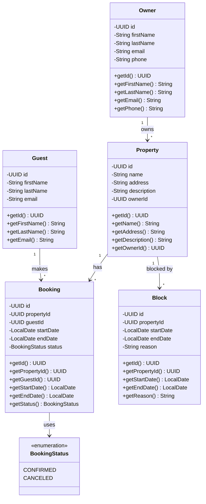

# Booking Application

A RESTful API for managing property bookings and blocks, built with Spring Boot and Java.

## Overview

This application allows property owners to manage their properties and guests to make bookings. It includes functionality to prevent overlapping bookings and handle property blocks (periods when properties are unavailable).

## Technology Stack

- **Java 25**
- **Spring Boot 3.5.6**
- **Spring Data JPA**
- **H2 Database** (in-memory)
- **Lombok**
- **Maven**

## Database Design

### UML Class Diagram



### Entities

#### Owner
Represents a property owner who can own multiple properties.

**Fields:**
- `id` (UUID, PK) - Unique identifier
- `firstName` (String) - Owner's first name
- `lastName` (String) - Owner's last name
- `email` (String) - Owner's email address
- `phone` (String) - Owner's phone number

#### Property
Represents a rentable property owned by an owner.

**Fields:**
- `id` (UUID, PK) - Unique identifier
- `name` (String) - Property name
- `address` (String) - Property address
- `description` (String) - Property description
- `ownerId` (UUID, FK) - Reference to Owner

#### Guest
Represents a guest who can make bookings.

**Fields:**
- `id` (UUID, PK) - Unique identifier
- `firstName` (String) - Guest's first name
- `lastName` (String) - Guest's last name
- `email` (String) - Guest's email address

#### Booking
Represents a reservation made by a guest for a property.

**Fields:**
- `id` (UUID, PK) - Unique identifier
- `propertyId` (UUID, FK) - Reference to Property
- `guestId` (UUID, FK) - Reference to Guest
- `startDate` (LocalDate) - Booking start date
- `endDate` (LocalDate) - Booking end date
- `status` (BookingStatus) - Booking status (CONFIRMED or CANCELED)

#### Block
Represents a period when a property is unavailable for booking.

**Fields:**
- `id` (UUID, PK) - Unique identifier
- `propertyId` (UUID, FK) - Reference to Property
- `startDate` (LocalDate) - Block start date
- `endDate` (LocalDate) - Block end date
- `reason` (String) - Reason for the block

#### BookingStatus (Enum)
- `CONFIRMED` - Booking is active
- `CANCELED` - Booking has been canceled

### Foreign Key Relationships

- `Property.ownerId` → `Owner.id` (Many-to-One)
- `Booking.propertyId` → `Property.id` (Many-to-One)
- `Booking.guestId` → `Guest.id` (Many-to-One)
- `Block.propertyId` → `Property.id` (Many-to-One)

### Design Principles

- **Plain UUID Foreign Keys**: Relationships are managed using plain UUID fields rather than JPA relationship annotations, simplifying JSON serialization and avoiding lazy loading issues in REST APIs.
- **Soft Delete Support**: Bookings use a `status` field to track cancellations rather than hard deletes, preserving historical data.
- **Overlap Prevention**: The model supports efficient queries to prevent overlapping bookings and blocks for the same property.

## Getting Started

### Prerequisites

- Java 25 or newer
- Maven (or use the included Maven Wrapper)

### Running the Application

```bash
# Using Maven Wrapper (recommended)
./mvnw spring-boot:run

# Or using Maven
mvn spring-boot:run
```

The application will start on `http://localhost:8080`

### Accessing the H2 Console

Once the application is running, you can access the H2 database console at:

```
http://localhost:8080/h2-console
```

**Connection Details:**
- **JDBC URL**: `jdbc:h2:mem:bookingdb`
- **Username**: `sa`
- **Password**: *(leave empty)*

### Sample Data

The application automatically initializes with sample data on startup:
- **3 Owners** (Alice Johnson, Michael Brown, Sarah Davis)
- **5 Properties** (Beachfront Villa, Mountain Cabin, City Apartment, Desert Oasis, Lake House)
- **5 Guests** (John Doe, Jane Smith, Bob Wilson, Emily Martinez, David Lee)

**Note:** The IDs are auto-generated. Check the console logs on startup to see the created IDs.

**Example Console Output:**
```
Created Owner: Alice Johnson - ID: a1b2c3d4-e5f6-7890-abcd-ef1234567890
Created Owner: Michael Brown - ID: b2c3d4e5-f6a7-8901-bcde-f12345678901
Created Property: Beachfront Villa - ID: d4e5f6a7-b8c9-0123-def1-234567890123 (Owner: Alice)
Created Property: Mountain Cabin - ID: e5f6a7b8-c9d0-1234-ef12-345678901234 (Owner: Alice)
...
```

Copy these IDs from the logs to use in your API requests or Postman environment variables.

## API Endpoints

### Booking Operations

| Method | Endpoint | Description |
|--------|----------|-------------|
| `POST` | `/api/bookings` | Create a new booking |
| `GET` | `/api/bookings/{id}` | Get booking by ID |
| `GET` | `/api/bookings/property/{propertyId}` | Get all bookings for a property |
| `PATCH` | `/api/bookings/{id}` | Update booking (dates and/or guest) |
| `PATCH` | `/api/bookings/{id}/cancel` | Cancel a booking |
| `PATCH` | `/api/bookings/{id}/rebook` | Rebook a canceled booking |
| `DELETE` | `/api/bookings/{id}` | Delete a booking |

### Block Operations

| Method | Endpoint | Description |
|--------|----------|-------------|
| `POST` | `/api/blocks` | Create a new block (owner only) |
| `GET` | `/api/blocks/{id}` | Get block by ID |
| `GET` | `/api/blocks/property/{propertyId}` | Get all blocks for a property |
| `PATCH` | `/api/blocks/{id}` | Update block (owner only) |
| `DELETE` | `/api/blocks/{id}?ownerId={ownerId}` | Delete a block (owner only) |

### Validation Rules

- ✅ **No overlapping bookings** - Cannot create/update bookings with overlapping dates for the same property
- ✅ **No booking during blocks** - Cannot create/update bookings during blocked periods
- ✅ **No blocks during bookings** - Cannot create/update blocks when property has existing bookings
- ✅ **Owner authorization** - Only property owners can create/update/delete blocks for their properties
- ✅ **Date validation** - Start date must be before end date, and cannot be in the past
- ✅ **Guest management** - Automatically creates or updates guest records based on email
- ✅ **Booking status** - Prevents updates to canceled bookings (must rebook first)

## API Examples

### Create a Booking

```bash
curl --location 'http://localhost:8080/api/bookings' \
--header 'Content-Type: application/json' \
--data-raw '{
    "propertyId": "your-property-uuid",
    "guestEmail": "john.doe@example.com",
    "guestFirstName": "John",
    "guestLastName": "Doe",
    "startDate": "2025-11-01",
    "endDate": "2025-11-05"
}'
```

### Create a Block (Owner Only)

```bash
curl --location 'http://localhost:8080/api/blocks' \
--header 'Content-Type: application/json' \
--data-raw '{
    "ownerId": "your-owner-uuid",
    "propertyId": "your-property-uuid",
    "startDate": "2025-12-20",
    "endDate": "2025-12-31",
    "reason": "Property maintenance"
}'
```

### Update a Booking

```bash
curl --location --request PATCH 'http://localhost:8080/api/bookings/{bookingId}' \
--header 'Content-Type: application/json' \
--data-raw '{
    "startDate": "2025-11-02",
    "endDate": "2025-11-06"
}'
```

### Cancel a Booking

```bash
curl --location --request PATCH 'http://localhost:8080/api/bookings/{bookingId}/cancel'
```

## Postman Collection

A complete Postman collection is available in the `postman/` directory:

- **`Booking-API.postman_collection.json`** - Complete API collection with all endpoints
- **`Booking-API-Local.postman_environment.json`** - Environment variables for local testing

### Import to Postman:
1. Open Postman
2. Click **Import**
3. Select both files from the `postman/` directory
4. Select the "Booking API - Local" environment
5. Update the `ownerId` and `propertyId` variables with actual IDs from your database

## Project Structure

```
src/main/java/com/booking/
├── config/          # Configuration classes (DataInitializer)
├── controller/      # REST controllers (BookingController, BlockController)
├── dto/             # Data Transfer Objects (Request/Response DTOs)
├── exception/       # Custom exception handling
├── model/           # Entity classes (Owner, Property, Guest, Booking, Block)
├── repository/      # JPA repositories
├── service/         # Business logic (BookingService, BlockService, GuestService)
└── validator/       # Validation logic (BookingValidator)
```

## Key Features

- **RESTful API** with proper HTTP methods and status codes
- **Comprehensive validation** to prevent data conflicts
- **Owner authorization** for block management
- **Automatic guest management** based on email
- **Flexible booking updates** (dates, guest info, or both)
- **Soft delete** for bookings (cancel/rebook functionality)
- **Sample data initialization** with detailed logging
- **H2 in-memory database** for easy testing
- **Postman collection** for quick API testing
- **Integration tests** with Spring Boot Test

## Running Tests

### Run All Tests

```bash
# Using Maven Wrapper
./mvnw test

# Or using Maven
mvn test
```

### Run Specific Test Class

```bash
./mvnw test -Dtest=CreateBookingIT
```

### Test Coverage

The integration tests cover:
- ✅ Successful booking creation
- ✅ Guest creation and update logic
- ✅ Property validation
- ✅ Date validation (past dates, start > end)
- ✅ Overlapping booking detection
- ✅ Block conflict detection
- ✅ Adjacent booking scenarios
- ✅ Canceled booking scenarios
- ✅ Required field validation

## License

This project is for educational purposes.
