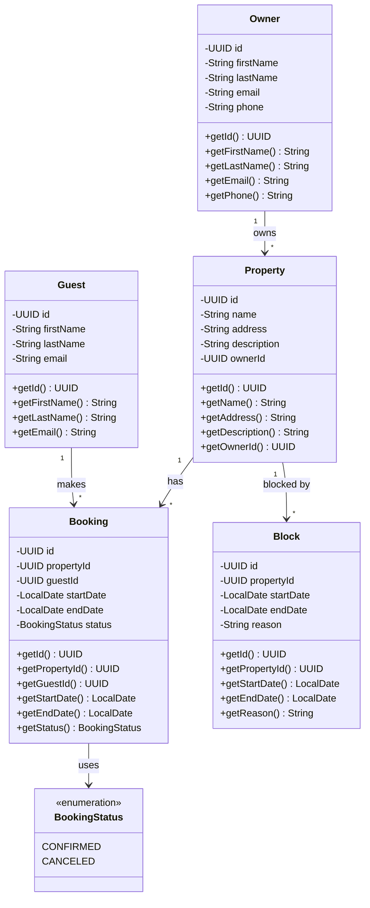

# Booking Application

A RESTful API for managing property bookings and blocks, built with Spring Boot and Java.

## Overview

This application allows property owners to manage their properties and guests to make bookings. It includes functionality to prevent overlapping bookings and handle property blocks (periods when properties are unavailable).

## Technology Stack

- **Java 25**
- **Spring Boot 3.5.6**
- **Spring Data JPA**
- **H2 Database** (in-memory)
- **Lombok**
- **Maven**

## Database Design

### UML Class Diagram



### Entities

#### Owner
Represents a property owner who can own multiple properties.

**Fields:**
- `id` (UUID, PK) - Unique identifier
- `firstName` (String) - Owner's first name
- `lastName` (String) - Owner's last name
- `email` (String) - Owner's email address
- `phone` (String) - Owner's phone number

#### Property
Represents a rentable property owned by an owner.

**Fields:**
- `id` (UUID, PK) - Unique identifier
- `name` (String) - Property name
- `address` (String) - Property address
- `description` (String) - Property description
- `ownerId` (UUID, FK) - Reference to Owner

#### Guest
Represents a guest who can make bookings.

**Fields:**
- `id` (UUID, PK) - Unique identifier
- `firstName` (String) - Guest's first name
- `lastName` (String) - Guest's last name
- `email` (String) - Guest's email address

#### Booking
Represents a reservation made by a guest for a property.

**Fields:**
- `id` (UUID, PK) - Unique identifier
- `propertyId` (UUID, FK) - Reference to Property
- `guestId` (UUID, FK) - Reference to Guest
- `startDate` (LocalDate) - Booking start date
- `endDate` (LocalDate) - Booking end date
- `status` (BookingStatus) - Booking status (CONFIRMED or CANCELED)

#### Block
Represents a period when a property is unavailable for booking.

**Fields:**
- `id` (UUID, PK) - Unique identifier
- `propertyId` (UUID, FK) - Reference to Property
- `startDate` (LocalDate) - Block start date
- `endDate` (LocalDate) - Block end date
- `reason` (String) - Reason for the block

#### BookingStatus (Enum)
- `CONFIRMED` - Booking is active
- `CANCELED` - Booking has been canceled

### Foreign Key Relationships

- `Property.ownerId` → `Owner.id` (Many-to-One)
- `Booking.propertyId` → `Property.id` (Many-to-One)
- `Booking.guestId` → `Guest.id` (Many-to-One)
- `Block.propertyId` → `Property.id` (Many-to-One)

### Design Principles

- **Plain UUID Foreign Keys**: Relationships are managed using plain UUID fields rather than JPA relationship annotations, simplifying JSON serialization and avoiding lazy loading issues in REST APIs.
- **Soft Delete Support**: Bookings use a `status` field to track cancellations rather than hard deletes, preserving historical data.
- **Overlap Prevention**: The model supports efficient queries to prevent overlapping bookings and blocks for the same property.

## Getting Started

### Prerequisites

- Java 25 or newer
- Maven (or use the included Maven Wrapper)

### Running the Application

```bash
# Using Maven Wrapper (recommended)
./mvnw spring-boot:run

# Or using Maven
mvn spring-boot:run
```

The application will start on `http://localhost:8080`

### Accessing the H2 Console

Once the application is running, you can access the H2 database console at:

```
http://localhost:8080/h2-console
```

**Connection Details:**
- **JDBC URL**: `jdbc:h2:mem:bookingdb`
- **Username**: `sa`
- **Password**: *(leave empty)*

### Sample Data

The application automatically initializes with sample data:
- 3 Owners
- 5 Properties
- 5 Guests

You can view this data in the H2 console or through the API endpoints.

## API Features (To Be Implemented)

The REST API will support the following operations:

### Booking Operations
- ✅ Create a booking
- ✅ Update booking dates and guest details
- ✅ Cancel a booking
- ✅ Rebook a canceled booking
- ✅ Delete a booking from the system
- ✅ Get a booking

### Block Operations
- ✅ Create a block
- ✅ Update a block
- ✅ Delete a block

### Validation
- ✅ Prevent overlapping bookings (same property, overlapping dates)
- ✅ Prevent bookings during blocked periods
- ✅ Ensure data integrity with proper validation

## Project Structure

```
src/main/java/com/booking/
├── config/          # Configuration classes (e.g., DataInitializer)
├── controller/      # REST controllers
├── dto/             # Data Transfer Objects
├── exception/       # Custom exception handling
├── model/           # Entity classes
├── repository/      # JPA repositories
└── service/         # Business logic services
```

## License

This project is for educational purposes.
